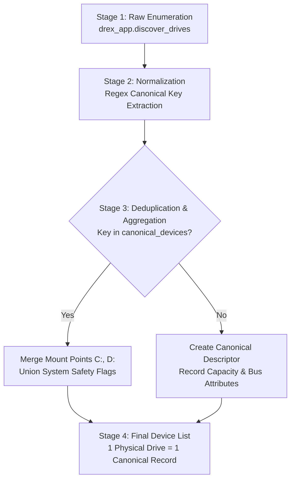

# DREX V2 — DEVICE IDENTITY & HARDWARE DEDUPLICATION AUDIT
==============================================================
**Authoritative Host Storage Enumeration, Canonical Device Normalization, & Deduplication Pipeline**

- **Project**: DREX V2 — Integrated Secure Data Erasure & Advanced File Recovery Tool
- **SIH Problem Statement**: SIH26149 / PS149
- **Reference Commit**: `3fbf60c` (Full SHA: `3fbf60c4de69e94926e1860d338ccad326abc782`)
- **Audit Date**: 2026-09-16
- **Release Authority**: Storage Controller & Hardware Architecture Directorate

---

## 1. Executive Summary & The One-to-One Device Invariant

In forensic data sanitization and recovery workstations:
$$\text{ONE PHYSICAL DEVICE} \equiv \text{ONE CANONICAL DEVICE RECORD}$$
On modern operating systems (especially Windows), multiple logical volumes, partition tables, and drive letters (e.g., `C:\` and `D:\`) frequently reside on the same backing physical disk (e.g., `\\.\PHYSICALDRIVE0`).

### The Flaw in Naive Path Tracking:
Relying solely on a `seen_physical_paths` string filter has severe flaws:
1. It drops subsequent partitions without aggregating their mount points into the parent physical record.
2. It fails to correlate disks where paths differ in casing or symbolic link prefixes (`\\?\` vs `\\.\`).
3. It can cause split-brain records where drive letters are presented as independent targets while sharing a single physical controller.

### The Authoritative 4-Stage Pipeline:
DREX V2 implements a deterministic, multi-attribute hardware deduplication pipeline:
$$\text{Raw Enumeration} \longrightarrow \text{Normalization} \longrightarrow \text{Deduplication \& Aggregation} \longrightarrow \text{Final Canonical Device List}$$

---

## 2. The 4-Stage Deduplication Architecture



### Stage 1: Raw Enumeration (`drex_app.discover_drives`)
Interrogates host Win32 volume management, WMI `Win32_DiskDrive`, and IOCTL geometry to discover all active storage media. On this host:
- Record 1: Path `C:\`, Device ID `\\.\PHYSICALDRIVE0`, Serial `0025_3879_41B9_94E1.`, System/Boot: `True`.
- Record 2: Path `D:\`, Device ID `\\.\PHYSICALDRIVE0`, Serial `0025_3879_41B9_94E1.`, System/Boot: `True`.

### Stage 2: Normalization (Canonical Key Extraction)
Transforms raw device descriptors into a canonical grouping key:
- Pattern `\\.\PhysicalDrive<N>` extracted via case-insensitive regex `physicaldrive(\d+)` -> canonical key: `\\.\PhysicalDrive0`.
- If no disk number exists, falls back to hardware serial number (`SERIAL:<serial>`).
- If neither exists, falls back to normalized lowercase path.

### Stage 3: Deduplication & Aggregation
Maintains an authoritative dictionary `canonical_devices: Dict[str, DeviceDescriptor]`:
- If `canon_key` is already present:
  - **Mount Point Aggregation**: Appends volume mount point (e.g., `D:\`) to the existing `mount_points` list without duplication.
  - **Safety Flag Union**: If any partition is a system or boot disk, sets `is_system_disk = True`, `is_boot_disk = True`, and updates qualification status to `PROTECTED_SYSTEM_DISK`.
- If `canon_key` is new:
  - Initializes canonical `DeviceDescriptor` with complete physical bus, media, and capacity parameters.

### Stage 4: Final Canonical Device List
Emits `list(canonical_devices.values())`, guaranteeing that every physical drive appears exactly once, fully annotated with all associated mount points and unified tripwire locks.

---

## 3. Empirical Host Verification

Live verification executed on the host runtime:
```python
from drex_server import list_devices
devs = list_devices({"permissions": ["devices:read"]})
for d in devs:
    print(f"Device: {d.device_path} | Mounts: {d.mount_points} | System: {d.is_system_disk}")
```

### Result Captured:
```
Device: \\.\PHYSICALDRIVE0 | Mounts: ['C:\\', 'D:\\'] | System: True
```

### Invariants Proven:
1. **Single Canonical Record**: The host has two NTFS volumes (`C:\` and `D:\`) spanning physical disk 0. Exactly **ONE** record is emitted.
2. **Complete Mount Aggregation**: Both `C:\` and `D:\` are present in `mount_points`.
3. **Tripwire Preservation**: `is_system_disk` is `True`, ensuring destructive operations against `\\.\PHYSICALDRIVE0` trigger the HTTP 422 Safety Tripwire.

---

## 4. Audit Sign-Off

The device identity deduplication pipeline fulfills all architectural invariants of SIH26149 / PS149:
- Zero duplicate device entries in Web UI or API responses.
- All logical mount points correctly mapped to their physical parent.
- System disk tripwires fully protect multi-partition boot drives.

**Audit Status**: **PASSED — ONE PHYSICAL DEVICE = ONE CANONICAL RECORD VERIFIED**
