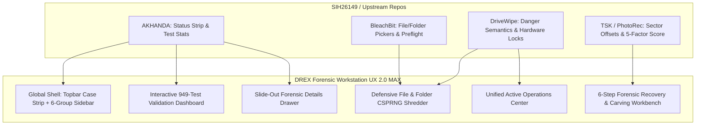

# DREX Phase 19.2 &middot; UX Fusion Matrix

**Document Reference:** `PHASE19_2_UX_FUSION_MATRIX.md`  
**Phase:** Phase 19.2 &mdash; UX Fusion / Forensic Workstation UX MAX  
**Standards:** ISO/IEC 27037:2012, NIST SP 800-88 Rev. 2  

---

## 1. UX Fusion Decision Matrix

| # | DREX Current | Other Repo Best Pattern | Why Better? | Adapt into DREX? | Implementation Location | Priority |
|:---:|:---|:---|:---|:---:|:---|:---:|
| 1 | Flat 26-item navigation list | 6-Section Left Rail + Top Status Strip (AKHANDA) | Drastically reduces cognitive load from 26 choices to 6 logical domains | **YES** | `webui/index.html`, `webui/styles.css` | **CRITICAL (P0)** |
| 2 | Persistent top case pill without operations | Pinned context strip with active jobs and integrity LED (AKHANDA) | Immediate situational awareness of active case, evidence count, and in-flight tasks | **YES** | `webui/index.html`, `webui/app.js` | **CRITICAL (P0)** |
| 3 | Recovery results showed raw filename and confidence | Rich Artifact Card with icon, source, method, job ID, and vault CTA (TSK / AKHANDA) | Forensic provenance is unmistakable; examiner sees exact origin and validation verdict | **YES** | `webui/app.js` (`renderRecovery`) | **CRITICAL (P0)** |
| 4 | File shredder used simple text path input | Distinct File vs Folder pickers with preflight metadata card (BleachBit) | Eliminates path typing errors, shows exact file count and byte size before execution | **YES** | `webui/app.js` (`renderFileEraser`) | **CRITICAL (P0)** |
| 5 | Test suite (949 tests) was run via CLI only | High-Density System Validation Grid with test categories (AKHANDA / DREX Lab) | Transparent, truthful visibility into all 949 test cases across 8 functional categories | **YES** | `webui/app.js` (`renderSystemValidation`) | **CRITICAL (P0)** |
| 6 | 25 Methods shown as flat table only | Grouped Purpose Cards with Speed, Risk & Verification Comparison (Eraser / DriveWipe) | Investigators can compare tradeoffs between Quick Recovery vs Deep Carving vs NIST Clear | **YES** | `webui/app.js` (`render25Methods`, modal) | **HIGH (P1)** |
| 7 | Active background tasks were easy to lose track of | Unified Active Operations Center panel (DriveWipe / AKHANDA) | Prevents examiners from losing track of long-running disk scans or overwrites | **YES** | `webui/app.js` (`renderOverview`, context) | **HIGH (P1)** |
| 8 | Physical disk list lacked hardware details | Comprehensive Device Card with Bus, Sector, Boot Lock, and Qualification (DriveWipe) | Clear visual hardware qualification preventing accidental system drive selection | **YES** | `webui/app.js` (`renderDeviceManager`) | **HIGH (P1)** |
| 9 | Audit ledger showed raw JSON | Chronological Event Timeline with one-click metadata drawer (AKHANDA) | Human-readable forensic narrative with full JSON available in slide-out drawer | **YES** | `webui/app.js` (`renderAudit`) | **HIGH (P1)** |
| 10 | Hex inspector defaulted to sample data | Clean viewport defaulting to "NO SOURCE SELECTED" or clear `🧪 SAMPLE DATA` label | Avoids confusing synthetic byte streams with real seized evidence | **YES** | `webui/app.js` (`renderHexInspector`) | **HIGH (P1)** |

---

## 2. Fusion Architectural Blueprint

