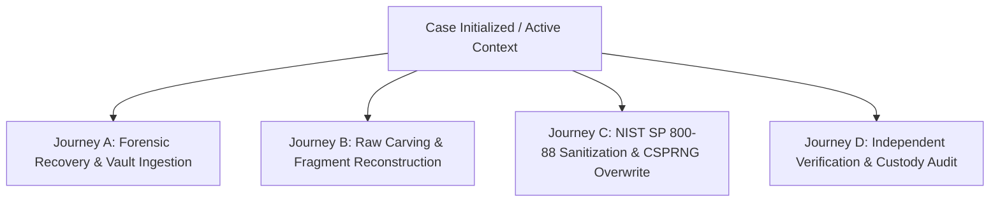

# DREX Forensic Workstation UX 2.0 &middot; User Journey Report

**Document Reference:** `PHASE19_USER_JOURNEY.md`  
**Phase:** Phase 19 &mdash; Forensic Workstation UX 2.0 (100&times; UI/UX Optimization)  
**Standard:** ISO/IEC 27037:2012 Digital Evidence Handling  

---

## 1. Overview & Objective

This document outlines the four primary end-to-end user journeys supported by the DREX Forensic Workstation UX 2.0. Each journey is structured with unambiguous action hierarchies, clear preconditions, live feedback, and tamper-evident audit sealing.

---

## 2. Journey A &mdash; Evidence Ingestion & Forensic Filesystem Recovery

### User Persona: Senior Forensic Examiner / Cyber Incident Responder
**Goal:** Recover deleted files, damaged inodes, and unallocated metadata from an acquired disk image while maintaining absolute write-block integrity.

1. **Active Case Confirmation:**
   - The examiner verifies the topbar `.case-switcher-bar` shows `Active Case: DREX-2026-001`.
   - If switching cases, the examiner clicks `[ Switch Case ]`, uses the search bar, and activates the target operational case.
2. **Navigating to Forensic Recovery:**
   - Clicks `INVESTIGATE -> Forensic Recovery` from the sidebar.
   - The view renders the 6-step stepper: `[1] Select Source -> [2] Inspect Details -> [3] Select Method -> [4] Preflight Review -> [5] Scan Telemetry -> [6] Vault Ingest`.
3. **Target Selection & Auto-Probing:**
   - Examiner selects `D:\ForensicData\TriageTarget.img` (or physical disk `\\.\PhysicalDrive1`).
   - The system auto-populates the **Detected Source Details Card**: Detected Filesystem (`FAT32 / NTFS`), Capacity (`512 MB`), Access Mode (`READ-ONLY / WRITE-PROTECTED`).
4. **Method Selection:**
   - Chooses `[M17] Quick Recovery — Fast filesystem-aware inode and metadata recovery`.
5. **Executing Recovery Scan:**
   - Examiner clicks `[ Launch Recovery Scan ]`.
   - The operation context bar transitions to `STATUS: SCANNING`, updating with live candidate discovery telemetry.
6. **Candidate Inspection via Slide-Out Drawer:**
   - Candidates appear in the table with 5-factor confidence scores (`0.982 HIGH`), format badges (`PNG`, `PDF`, `SQLITE`), and provenance badges (`🔍 REAL EVIDENCE`).
   - Examiner clicks `[ Details ]` on a candidate to view the 5-factor breakdown (Header, Footer, Structure, Entropy, Seam).
7. **Evidence Ingestion into Vault:**
   - Examiner clicks `[ 📥 Ingest ]`.
   - The candidate is ingested into the isolated case vault, sealed with an immutable SHA-256 digest, and recorded in the audit ledger.

---

## 3. Journey B &mdash; Raw Sector Carving & Out-of-Order Fragment Reconstruction

### User Persona: Malware Analyst / Forensic Lab Specialist
**Goal:** Reassemble non-contiguous fragmented file clusters across corrupt or unallocated storage sectors.

1. **Raw Sector Carving:**
   - Examiner navigates to `INVESTIGATE -> Raw File Carving`.
   - The operation context bar binds `WORKFLOW: RAW CARVING` and selected target.
   - Examiner selects signature profile (`DOCUMENTS` or `ALL`) and clicks `[ Launch Raw Carve Engine ]`.
   - Discovered raw extents are presented with byte offsets, size, and header/footer match confidence.
2. **Fragment Reassembly Setup:**
   - Examiner navigates to `INVESTIGATE -> Fragment Reconstruction`.
   - The view presents the **Input Candidate Fragment Set** cards:
     - `Chunk 1 (Header Extent)`: Offset `0x0000`, 33 Bytes, PNG Magic Signature `89 50 4E 47`.
     - `Chunk 2 (Footer Extent)`: Offset `0x1000`, 12 Bytes, `IEND` Trailer Signature `49 45 4E 44`.
3. **Seam Continuity & Reassembly:**
   - Examiner selects Seam Sensitivity (`Balanced >= 0.50`) and clicks `[ 🧩 Reassemble & Validate Fragments ]`.
   - The engine validates header/footer extents, container structure, and Shannon entropy.
   - Result card shows `✓ PASS: Reconstructed PNG (4,129 Bytes)`, SHA-256 digest, and `[ Ingest Reconstructed Artifact ]` button.

---

## 4. Journey C &mdash; NIST SP 800-88 Sanitization & File Shredding

### User Persona: Security Officer / Workstation Custodian
**Goal:** Perform standards-compliant data sanitization on target storage media with zero-trust confirmation and post-wipe readback verification.

1. **Policy Planning (Sanitization Planner):**
   - Custodian navigates to `SANITIZE -> Sanitization Planner`.
   - Selects target device (`PhysicalDrive1` or logical image) and Security Categorization (`Moderate (Purge)`).
   - Engine auto-detects media type (`FLASH_SSD`) and displays recommended method: `[Method 01] NIST SP 800-88 Rev. 2 Clear/Purge`.
   - Result card displays `PLAN STATUS: READY` (Execution: NOT STARTED).
2. **Logical File & Folder Shredding (File Eraser):**
   - Custodian navigates to `SANITIZE -> File & Folder Eraser`.
   - Selects target type: `○ FILE` or `○ FOLDER`.
   - Clicks `[ Browse File ]` to open the native OS file picker.
   - Selected target metadata card displays: `Path: sample_evidence.docx`, `Type: FILE`, `Size: 24.5 KB`, `Readable: YES`.
3. **Safety Phrase Preflight:**
   - The preflight engine analyzes target path:
     - System volumes (`C:\Windows`, `C:\Program Files`) immediately trigger `🔒 SAFETY TRIPWIRE: EXECUTION_DISABLED`.
     - Safe non-system targets require exact confirmation phrase: `ERASE-D__FORENSICDATA_SAMPLE_EVIDENCE_DOCX-PERMANENT`.
   - Button unlocks only when phrase matches.
4. **Execution & Entropy Gauge:**
   - Custodian clicks `[ ⚡ Execute Secure Overwrite ]`.
   - Backend performs real CSPRNG overwrite, measures post-wipe Shannon entropy ($H \ge 7.999$ bits/byte), and verifies 0 readback mismatches.
   - Custodian clicks `[ 📜 Issue Attestation Certificate ]` to generate tamper-evident proof.

---

## 5. Journey D &mdash; Independent Verification & Custody Audit

### User Persona: Court Judge / Third-Party Forensic Auditor
**Goal:** Independently verify cryptographic seals, Merkle audit chains, and tamper-evident PDF certificates without relying on active application state.

1. **Certificate Verification:**
   - Auditor navigates to `REPORT -> Certificates`.
   - Table displays issued certificates for active case with method, examiner, and SHA-256 hash.
   - Auditor clicks `[ 🛡 Verify ]`. Engine computes SHA-256 preimages and returns `✓ PASS — CERTIFICATE_TAMPER_EVIDENT`.
   - Auditor clicks `[ PDF ↓ ]` to download pure Python vector PDF attestation certificate.
2. **Independent Schema 2.0 Verifier:**
   - Auditor navigates to `VERIFY -> Independent Verifier`.
   - Clicks `[ Browse Package ]` to select an exported `.zip` evidence archive.
   - Clicks `[ 🛡 Verify Evidence Package ]`.
   - The standalone `drex_verify.py` runner recomputes all SHA-256 manifests and exits with Code `0` (`VERDICT: VERIFIED`).
3. **Audit Ledger Inspection:**
   - Auditor navigates to `REPORT -> Audit Ledger`.
   - Reviews chronological Merkle sequence (`#1` to `#N`).
   - Clicks `[ Details ]` on an event to inspect cryptographic preimages and SHA-256 Merkle chain linkages.
