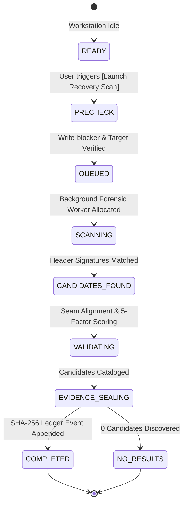
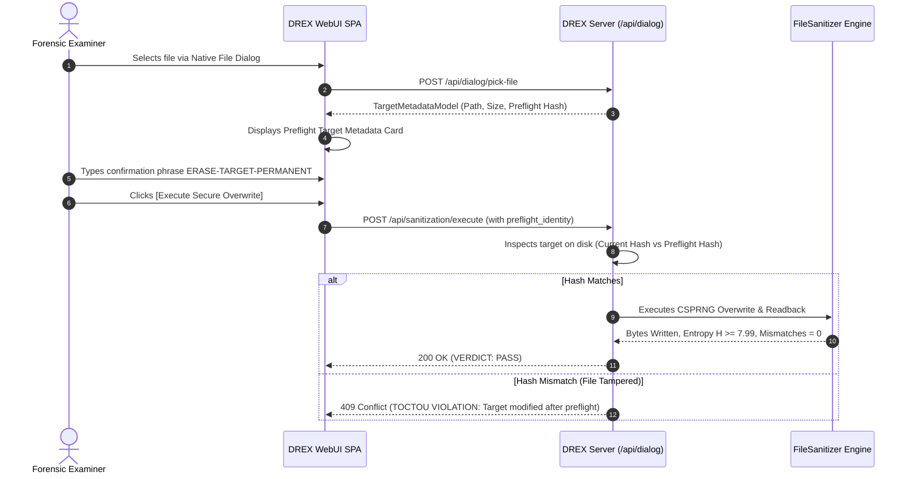

# DREX V2 — PHASE 21 UI ACTION MATRIX & STATE TRANSITION REPORT
**Authoritative Baseline:** `fbad09d`  
**Execution Environment:** Windows 11 (AMD64)  
**Date:** September 16, 2026  

---

## 1. Complete Forensic View Action Matrix

| View ID | Primary User Action | Trigger Element | API Route / Backend Hook | Preflight Validations | State Transitions & Terminal Verdict |
| :--- | :--- | :--- | :--- | :--- | :--- |
| **`overview`** | Switch Active Case | `[ Switch Case ]` | `POST /api/cases` / State binding | Case selection | Session context bound to selected case number |
| **`system_validation`** | Load & Filter 949 Tests | Category cards / Status dropdown / Search bar | `GET /api/validation/test-results` | Machine artifact loaded | Live inventory rendered; Category counts sum to 960 (949 base + 11 Phase 21); Paginated (50/page) |
| **`system_validation`** | View Test Details | Test item click `openTestDetailsDrawer()` | In-memory lookup / `tests` array | Node ID validation | Drawer opens with Node ID, module, docstring, duration, status, and traceback |
| **`judge_demo`** | Execute Mode A: Synthetic Proof | `[ ✦ Execute Synthetic Proof Loop ]` | `POST /api/demo/flow` | In-memory test engine | Stepper advances (1→6); Completed in < 1.5s; Verdict: `SYNTHETIC EVALUATION PROOF — PASS` |
| **`judge_demo`** | Execute Mode B: Operational Demo | `[ ⚡ Execute Operational Demonstration ]` | `POST /api/demo/operational-flow` | Local safe fixture file created on disk | DeepCarver extracts headers; CSPRNG wipes buffer; Entropy $H \ge 7.98$ measured; SHA-256 sealed; Real PDF certificate issued |
| **`methods`** | Inspect 25-Method Matrix | Method card click `useMethodFromMatrix()` | In-memory registry / `GET /api/system/version` | Method ID resolution | Routes directly to corresponding workflow view (`drive_eraser`, `file_eraser`, `recovery`) |
| **`cases`** | Register New Case | `[ + New Case ]` | `POST /api/cases` | Examiner, Title, Case number | New tamper-evident directory created under `vault/<case_id>` |
| **`vault`** | Ingest Recovered Artifact | `[ Ingest Evidence ]` | `POST /api/recovery/extract` | Candidate ID, SHA-256 hash | Artifact copied to vault; Hash chain event recorded; Evidence ID assigned |
| **`audit`** | Verify Cryptographic Ledger | `[ Verify Audit Ledger ]` | `POST /api/audit/verify` | SHA-256 Merkle chain | Merkle root calculated; Zero-tamper verified (`VERIFIED_INTACT`) |
| **`certificates`** | Download Signed PDF | `[ Download PDF ]` | `GET /api/certificates/{id}/pdf` | Case ID binding | Returns binary `%PDF-1.4` file with SHA-256 attestation |
| **`recovery`** | Browse Forensic Disk Image | `[ 📁 Browse Image ]` | `POST /api/dialog/pick-file` | File existence, Image extension | Opens native Windows file dialog; Updates target select with absolute path |
| **`recovery`** | Launch Recovery Scan | `[ ⌕ Launch Recovery Scan ]` | `POST /api/recovery/scan` $\to$ `GET /api/jobs/{id}` | Active case selected, Source valid | Polling state machine: `PRECHECK` → `QUEUED` → `SCANNING` → `VALIDATING` → `COMPLETED` |
| **`carving`** | Run Raw File Carving | `[ Run Deep Carver ]` | `POST /api/recovery/scan` (`engine="21"`) | Source stream valid | Direct magic-byte matching; 5-factor confidence scoring |
| **`fragments`** | Reassemble Out-of-Order | `[ 🧩 Reconstruct Fragments ]` | `POST /api/recovery/reconstruct` | Chunk boundary signatures | Seam analysis (0.00 to 1.00 correlation); Continuous payload reassembled |
| **`file_eraser`** | Browse File (Native) | `[ 📁 Browse File ]` | `POST /api/dialog/pick-file` | Native Windows dialog | Returns real absolute path (`D:\...`); Renders preflight metadata card |
| **`file_eraser`** | Browse Folder (Native) | `[ 📁 Browse Folder ]` | `POST /api/dialog/pick-folder` | Native Windows dialog | Returns real folder path; Computes recursive file count and total size |
| **`file_eraser`** | Inspect Target Live | Real-time path input listener | `POST /api/dialog/inspect-target` | Target existence & permission | Displays Path, Type, File Count, Total Size, Readable, Protected, Filesystem, Case Binding, Preflight Hash |
| **`file_eraser`** | Execute Secure Overwrite | `[ ⚡ Execute Secure Overwrite ]` | `POST /api/sanitization/execute` | Exact Confirmation Phrase (`ERASE-...-PERMANENT`), Anti-TOCTOU Revalidation | Overwrite executed; Shannon entropy $H \ge 7.99$ measured; Readback verified; Attestation certificate generated |
| **`drive_eraser`** | Physical Drive Wipe | `[ ⚡ Erase Physical Drive ]` | `POST /api/sanitization/execute` | Elevation check, OS Boot Tripwire, Safety Phrase | Hardware/simulated block overwrite; Readback verified; System disk protected |
| **`residue_analyzer`** | Scrub Cluster Slack | `[ 🧹 Scrub Slack Space ]` | `POST /api/sanitization/execute` (`method_id=10`) | Active case selected | End-of-file cluster tail zero-filled; Payload hash unchanged |
| **`verification`** | 64-Sector Visualizer | Live Telemetry Grid | `GET /api/sanitization/sector-grid` | Sampling interval | Blocks styled by state: Zeroed (`0x00`), CSPRNG (`RND`), Slack (`SLK`), Unallocated (`U`) |
| **`validation_lab`** | Ground Truth Suite | `[ Run Ground Truth Validation ]` | `POST /api/validation/run` | Known synthetic corruption | Bit-for-bit ground truth differential comparison |
| **`performance_lab`** | Benchmark Telemetry | `[ Run Performance Benchmark ]` | `POST /api/performance/benchmark` | IO thread allocation | Throughput (MB/s), IOPS, and memory scaling benchmark graphs |
| **`reports`** | Export Chain-of-Custody | `[ Generate Dossier ]` | `GET /api/reports/case/{id}` | Case ID | Complete multi-artifact chain of custody PDF dossier |
| **`device_intelligence`** | IOCTL Capability Discovery | `[ Scan Hardware ]` | `GET /api/devices` | Storage controller probe | Bus type, ATA/NVMe pass-through, trim capability matrix |
| **`diagnostics`** | System Health & Elevation | Diagnostic grid render | In-memory / `GET /api/system/version` | Privilege detection | Displays authoritative Commit (`fbad09d`), Build ID, SW Cache partition, 949 tests passed |
| **`settings`** | Backup Sealed Case Archive | `[ Backup Case ]` | `POST /api/cases/backup` | Case ID | Creates SHA-256 verified ZIP container |

---

## 2. Verified Recovery State Machine Lifecycle

---

## 3. Anti-TOCTOU Preflight Revalidation Cycle

