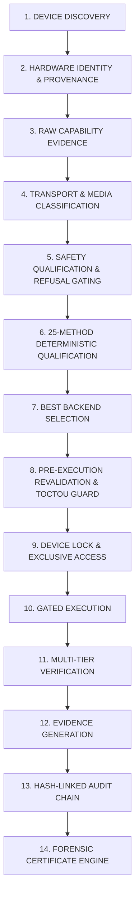

# DREX-V2 Phase 7 Production Hardening Implementation Plan
## Device Intelligence & Hardware Qualification Layer

**Baseline:** Commit `d1d9c7d`  
**Phase 6 Status:** **FROZEN (510 / 510 Tests PASS, 0 Failures, 0 Skips)**  
**Target Capability:** Production-grade, deterministic, safety-critical, evidence-driven Device Intelligence & Hardware Qualification across all 25 canonical methods (M01–M25).

---

## 1. Executive Architectural Blueprint

The Device Intelligence and Hardware Qualification Architecture enforces a deterministic, 14-stage gated pipeline that rigorously inspects, classifies, revalidates, and safety-gates storage devices before permitting destructive operations or read-only forensic recovery:



### Core Architecture Principles:
1. **Separation of Concerns**: Device discovery captures raw hardware facts; capability interrogation collects controller-level evidence; the safety state machine enforces fail-closed gates; the 25-method qualification engine computes deterministic method records; the execution engine requires immediate pre-execution revalidation.
2. **Zero Optimistic Inference**: Unknown properties remain `UNKNOWN` (never silently cast to `NOT_APPLICABLE`). Transport buses (e.g. USB) are decoupled from underlying drive interfaces (e.g. SATA/NVMe).
3. **Fail-Closed Safety Guarantee**: All dangerous, ambiguous, frozen, locked, system, boot, or USB-bridged conditions unconditionally refuse destructive execution (`NO DESTRUCTIVE EXECUTION`).
4. **Independent Truth Model Invariants**: Never collapse capability detection, software qualification, backend availability, execution state, and physical qualification.

---

## 2. Lock, Interruption & Failure Semantics

Destructive operations strictly adhere to fail-closed state transitions. The system never guesses physical outcomes or fabricates execution success:

```text
SAFETY FAILURE
  └──► ABORT ──► NO DESTRUCTIVE EXECUTION

LOCK FAILURE
  └──► ABORT ──► NO DESTRUCTIVE EXECUTION

IDENTITY DRIFT (TOCTOU)
  └──► ABORT ──► NO DESTRUCTIVE EXECUTION

CAPABILITY DRIFT
  └──► ABORT ──► NO DESTRUCTIVE EXECUTION

DEVICE DISAPPEARANCE DURING EXECUTION
  └──► STOP / INTERRUPT
  └──► DO NOT GUESS PHYSICAL OUTCOME
  └──► RECORD UNKNOWN / INDETERMINATE OUTCOME
  └──► RECORD AUDIT SECURITY EVENT
  └──► ATTEMPT SAFE HANDLE RELEASE / RECOVERY PROCEDURE
```

---

## 3. Definitive Truth Model & State Invariants

Every method qualification and hardware execution assessment maintains separate, independent truth model fields:

```python
@dataclass
class HardwareTruthModel:
    capability_detected: bool          # True only if controller/IOCTL capability verified
    backend_available: bool            # True if executable backend adapter is present
    execution_possible: bool           # True only if safety gates, privilege & locks pass
    execution_state: str               # REAL | SIMULATED | UNSUPPORTED | BLOCKED
    verification_state: str            # STATUS_LOG_READBACK | EXACT_BYTE_READBACK | HASH_VERIFIED | NONE
    software_qualification: str        # SOFTWARE-QUALIFIED
    physical_execution: str            # NOT_EXECUTED (default) | EXECUTED (authorized sacrificial device)
    physical_qualification: str        # NOT_ESTABLISHED (default) | QUALIFIED (empirically sealed physical evidence)
    qualification_status: str          # AVAILABLE | AVAILABLE_WITH_LIMITATIONS | NOT_APPLICABLE | UNSUPPORTED | BLOCKED
    blocking_reasons: List[str]        # Exact safety refusal codes
    limitations: List[str]             # Machine-readable hardware/protocol limitations
```

### Canonical Physical Qualification Rule:
Unless an explicitly authorized sacrificial-device qualification has actually been executed on an authorized sacrificial device (`DREX_PHYSICAL_TEST_DEVICE` + `DREX_PHYSICAL_TEST_AUTHORIZED=YES`) and independently verified:
* `physical_execution = NOT_EXECUTED`
* `physical_qualification = NOT_ESTABLISHED`

Software qualification and capability detection **MUST NEVER** upgrade this state automatically. Automated test results can never establish physical qualification.

---

## 4. Data Models & Raw Evidence Provenance

### 4.1 Raw Property Value with Provenance Tracking
Every hardware property retains its decoded value, raw representation, discovery source, and confidence status:

```python
class PropertySource(enum.Enum):
    IOCTL_STORAGE_QUERY_PROPERTY = "IOCTL_STORAGE_QUERY_PROPERTY"
    IOCTL_STORAGE_PROTOCOL_COMMAND = "IOCTL_STORAGE_PROTOCOL_COMMAND"
    IOCTL_ATA_PASS_THROUGH = "IOCTL_ATA_PASS_THROUGH"
    IOCTL_DISK_GET_DRIVE_GEOMETRY_EX = "IOCTL_DISK_GET_DRIVE_GEOMETRY_EX"
    IOCTL_DISK_GET_LENGTH_INFO = "IOCTL_DISK_GET_LENGTH_INFO"
    IOCTL_VOLUME_GET_VOLUME_DISK_EXTENTS = "IOCTL_VOLUME_GET_VOLUME_DISK_EXTENTS"
    WIN32_CIM_WMI_FALLBACK = "WIN32_CIM_WMI_FALLBACK"
    SYNTHETIC_TEST_DESCRIPTOR = "SYNTHETIC_TEST_DESCRIPTOR"
    UNAVAILABLE = "UNAVAILABLE"

@dataclass
class HardwareFact:
    value: Any
    source: PropertySource
    confidence: str  # AUTHORITATIVE_IOCTL | DERIVED_FALLBACK | SYNTHETIC | UNVERIFIED
    raw_hex: Optional[str] = None
```

### 4.2 Layered Device Identity Model
Decouples the outer transport bus from the inner drive interface and solid-state/magnetic media:

```python
class TransportBus(enum.Enum):
    NVME = "NVME"
    SATA = "SATA"
    ATA = "ATA"
    USB = "USB"
    SCSI = "SCSI"
    SAS = "SAS"
    IEEE1394 = "IEEE1394"
    VIRTUAL = "VIRTUAL"
    UNKNOWN = "UNKNOWN"

class UnderlyingInterface(enum.Enum):
    NATIVE_NVME = "NATIVE_NVME"
    NATIVE_SATA = "NATIVE_SATA"
    NATIVE_SAS = "NATIVE_SAS"
    USB_BRIDGE_SATA = "USB_BRIDGE_SATA"
    USB_BRIDGE_NVME = "USB_BRIDGE_NVME"
    USB_BRIDGE_MASS_STORAGE = "USB_BRIDGE_MASS_STORAGE"
    VIRTUAL_BACKED = "VIRTUAL_BACKED"
    UNKNOWN = "UNKNOWN"

class MediaType(enum.Enum):
    NVME_SSD = "NVME_SSD"
    SATA_SSD = "SATA_SSD"
    ROTATIONAL_HDD = "ROTATIONAL_HDD"
    FLASH_USB = "FLASH_USB"
    OPTICAL = "OPTICAL"
    VIRTUAL_DISK = "VIRTUAL_DISK"
    UNKNOWN = "UNKNOWN"

@dataclass
class DeviceIdentitySnapshot:
    snapshot_id: str
    timestamp_utc: str
    physical_drive_index: HardwareFact       # int (e.g. 1)
    device_path: HardwareFact                # str (e.g. "\\.\PhysicalDrive1")
    vendor_id: HardwareFact                  # str
    product_id_model: HardwareFact           # str
    serial_number: HardwareFact              # str
    firmware_revision: HardwareFact          # str
    capacity_bytes: HardwareFact             # int
    logical_sector_size: HardwareFact        # int (512, 4096)
    physical_sector_size: HardwareFact       # int (512, 4096)
    transport_bus: HardwareFact              # TransportBus
    underlying_interface: HardwareFact       # UnderlyingInterface
    media_type: HardwareFact                 # MediaType
    is_removable: HardwareFact               # bool
    is_write_protected: HardwareFact         # bool
    is_usb_bridge: HardwareFact              # bool
    system_disk_relationship: HardwareFact   # bool
    boot_disk_relationship: HardwareFact     # bool
    mounted_volume_letters: HardwareFact     # List[str] (e.g. ["E:", "F:"])
    partition_extents: HardwareFact          # List[Dict[str, Any]]
```

### 4.3 Raw Controller Capability Evidence
Preserves exact raw bitfields and parsed structures from ATA and NVMe command headers:

```python
@dataclass
class AtaCapabilityEvidence:
    identify_supported: bool
    security_supported: bool
    security_enabled: bool
    security_locked: bool
    security_frozen: bool
    enhanced_erase_supported: bool
    normal_erase_time_minutes: int
    enhanced_erase_time_minutes: int
    raw_word_128: Optional[int] = None
    source: PropertySource = PropertySource.UNAVAILABLE

@dataclass
class NvmeCapabilityEvidence:
    admin_identify_supported: bool
    format_nvm_supported: bool
    format_crypto_erase_supported: bool
    sanitize_supported: bool
    sanitize_block_erase_supported: bool
    sanitize_crypto_erase_supported: bool
    sanitize_overwrite_supported: bool
    sanitize_no_deallocate_supported: bool
    namespace_count: int
    active_nsid: int
    lba_format_index: int
    formatted_lba_size: int
    raw_oacs: Optional[int] = None
    raw_sanicap: Optional[int] = None
    source: PropertySource = PropertySource.UNAVAILABLE
```

---

## 5. Hardware Safety State Machine & Pre-Execution Revalidation

### 5.1 Explicit Device Safety Lifecycle
The device lifecycle strictly progresses through 11 states:

```text
[DISCOVERED] 
    │
    ▼
[VALIDATED] 
    │
    ▼
[SAFETY_CHECKED] ──(Refusal / Failure)──► [FAIL CLOSED: BLOCKED]
    │
    ▼
[LOCK_REQUESTED] ──(Volume Locked)─────► [FAIL CLOSED: DEVICE_LOCK_REQUIRED]
    │
    ▼
[LOCK_ACQUIRED] 
    │
    ▼
[EXCLUSIVE_ACCESS] 
    │
    ▼
[PRE_EXECUTION_REVALIDATED] ──(TOCTOU Mismatch)──► [FAIL CLOSED: IDENTITY_CHANGED]
    │
    ▼
[EXECUTION_ALLOWED] 
    │
    ▼
[EXECUTING] 
    │
    ▼
[VERIFYING] 
    │
    ▼
[RELEASED]
```

### 5.2 Comprehensive Refusal & Blocking States
When any safety invariant is violated, execution fails closed with specific blocking reasons:
* `SYSTEM_DISK_BLOCKED`: Target matches `%SystemDrive%`, Windows installation directory, or system partition.
* `BOOT_DISK_BLOCKED`: Target contains EFI System Partition (`ESP`), Active Boot partition, or crash dump volume.
* `ACTIVE_OS_VOLUME`: Target volume is currently mounted and active as an operating system filesystem.
* `APPLICATION_PATH_TARGET`: Target contains the running DREX application directory or evidence storage path.
* `FROZEN`: ATA security feature set is in the BIOS/UEFI FROZEN state.
* `LOCKED`: ATA security feature set is password-locked.
* `WRITE_PROTECTED`: Media reports read-only or hardware write-protect switch engaged.
* `USB_BRIDGE_LIMITATION`: USB bridge translates/blocks native ATA/NVMe pass-through commands.
* `DEVICE_LOCK_REQUIRED`: Exclusive volume dismount (`FSCTL_LOCK_VOLUME`, `FSCTL_DISMOUNT_VOLUME`) failed.
* `PRIVILEGE_REQUIRED`: Administrator token required for physical device handle / IOCTL command path.
* `PRIVILEGE_DENIED`: UAC elevation prompt was cancelled or denied by operator.
* `IDENTITY_CHANGED`: Pre-execution revalidation detected device substitution or parameter drift.
* `DEVICE_DISAPPEARED`: Device handle invalid or device disconnected between discovery and execution.
* `CAPABILITY_CHANGED`: Controller capabilities changed between discovery and execution.
* `UNSUPPORTED`: Method requested is not supported by target controller interface.

### 5.3 Pre-Execution Revalidation & TOCTOU Protection
Immediately prior to issuing any destructive command, DREX performs an atomic pre-execution revalidation:
1. Re-open device handle with `GENERIC_READ | GENERIC_WRITE` and `FILE_SHARE_READ`.
2. Query `IOCTL_STORAGE_QUERY_PROPERTY` and `IOCTL_DISK_GET_LENGTH_INFO`.
3. Compare pre-execution identity snapshot against discovery snapshot:
   * Match `physical_drive_index`
   * Match `device_path`
   * Match `serial_number`
   * Match `product_id_model`
   * Match `capacity_bytes`
   * Match `logical_sector_size` and `physical_sector_size`
   * Match `transport_bus` and `underlying_interface`
   * Match `system_disk_relationship`
4. If ANY field mismatches: **ABORT EXECUTION IMMEDIATELY**, record `IDENTITY_CHANGED`, log audit security alert, and fail closed.

---

## 6. Deterministic 25-Method Qualification Engine

Function `evaluate_25_methods(identity: DeviceIdentitySnapshot, caps: DeviceCapabilities) -> Dict[int, MethodQualificationRecord]` deterministically returns all 25 canonical methods:

```python
@dataclass
class MethodQualificationRecord:
    method_id: int
    canonical_name: str
    category: str                      # "Drive Erasure" | "File/Folder Erasure" | "Recovery"
    applicability: str                 # APPLICABLE | APPLICABLE_WITH_LIMITATIONS | NOT_APPLICABLE | UNSUPPORTED
    qualification_status: str          # AVAILABLE | LIMITED | BLOCKED | UNSUPPORTED
    selected_backend: str
    required_capabilities: List[str]
    detected_capabilities: List[str]
    missing_capabilities: List[str]
    blocking_reasons: List[str]
    limitations: List[str]
    safety_state: str
    truth_model: HardwareTruthModel
    applicable_media: List[MediaType]
    timestamp_utc: str
```

### Method Groups & Qualification Rules:

#### 1. M01–M07 (Drive Erasure & Hardware Sanitization):
* **M01 (NIST SP 800-88 Policy Engine)**: Evaluates media type and bus. Selects NVMe Sanitize / ATA Secure Erase for internal SSD/HDD or 1-Pass Clear for USB/Virtual. Supports dual-profile (`REV_1` / `REV_2`). Policy selection is never represented as physical erasure proof.
* **M02 (Smart Sanitization)**: Multi-tier decision evaluator selecting optimal firmware Purge or multi-pass overwrite based on controller interface.
* **M03 (Device-Native Sanitize)**: Requires NVMe Sanitize or SCSI/SATA native Sanitize. Fails closed on USB (`USB_BRIDGE_LIMITATION`).
* **M04 (ATA Secure Erase)**: Requires `NATIVE_SATA`/`NATIVE_ATA`, `security_supported=True`, `security_frozen=False`, `security_locked=False`. Fails closed on USB (`USB_BRIDGE_LIMITATION`) and frozen drives (`FROZEN`).
* **M05 (NVMe Secure Erase)**: Requires `NATIVE_NVME` with `format_nvm_supported=True` or `sanitize_supported=True`. Fails closed on USB (`USB_BRIDGE_LIMITATION`).
* **M06 (IEEE 2883 Purge)**: Enterprise purge policy dispatcher mapping drive type to IEEE 2883 sanitize actions. Policy selection is never represented as physical erasure proof.
* **M07 (Verified Overwrite)**: Direct block multi-pass overwrite. Qualified on all non-system drives; fails closed on write-protected media.

#### 2. M08–M16 (File/Folder Erasure & Storage-Aware Sanitization):
* **M08 (CSPRNG Random Overwrite)**: File-level overwrite. Qualified across filesystems. Attaches `FLASH_WEAR_LEVELING` and `LOGICAL_COVERAGE_ONLY` machine-readable limitations on SSD/Flash.
* **M09 (Cryptographic Erasure)**: Key lifecycle revocation. Attaches `PYTHON_MEMORY_RESIDUAL_LIMITATION` and `HARDWARE_SED_DEPENDENT`.
* **M10 (File Slack / Cluster-Tip)**: Logical cluster-tip zeroing. Attaches `PHYSICAL_SLACK_NOT_PROVEN` and `FILESYSTEM_DRIVER_DEPENDENT`.
* **M11 (Filesystem Metadata / MFT)**: Inactive MFT scrubbing. Protected by 9-stage pipeline and system volume lock qualification.
* **M12 (NIST SP 800-88 File Policy Engine)**: Dual-profile (`REV_1` / `REV_2`) file policy dispatcher.
* **M13 (Secure Free-Space Wiping)**: Headroom-guarded allocation filling. Truthfully classified as `LOGICAL_FREE_SPACE_COVERAGE: COMPLETED`; attaches `FLASH_WEAR_LEVELING` and `CONTROLLER_REMAP` on SSDs.
* **M14 (Single-Pass Zero Overwrite)**: File-level zero-fill.
* **M15 (Storage-Aware Fallback)**: Intelligent fallback matrix dispatching from firmware commands down to logical overwrite.
* **M16 (Temporary / Cache Sanitization)**: Temp file cleanup with metadata scrambling.

#### 3. M17–M25 (Forensic Recovery):
* **M17–M25 (Recovery Methods)**: Strictly **READ-ONLY**. Evaluates source accessibility (`GENERIC_READ`), filesystem signatures, partition geometry, and backend tool availability (TSK 4.15.0, PhotoRec 7.2, ddrescue 1.28). Recovery qualification is never blocked merely because sanitization write capabilities are unavailable.

---

## 7. SSD / Flash Limitations & Machine-Readable Evidence

For all solid-state, flash, and wear-leveled devices, structured machine-readable limitations are bound to method results, certificates, and audit logs:
```python
class StorageLimitation(enum.Enum):
    FLASH_WEAR_LEVELING = "FLASH_WEAR_LEVELING: Controller wear-leveling algorithm may retain unreferenced physical flash blocks."
    CONTROLLER_REMAP = "CONTROLLER_REMAP: Bad block and over-provisioned physical sectors are inaccessible to logical overwrite."
    SPARE_BLOCKS = "SPARE_BLOCKS: Retired and spare physical NAND blocks cannot be addressed or verified by host software."
    PHYSICAL_MEDIA_COVERAGE_NOT_PROVEN = "PHYSICAL_MEDIA_COVERAGE_NOT_PROVEN: Logical write operations do not guarantee 100% physical cell coverage."
    LOGICAL_COVERAGE_ONLY = "LOGICAL_COVERAGE_ONLY: Sanitization verified strictly within host-accessible logical block address space."
    USB_BRIDGE_LIMITATION = "USB_BRIDGE_LIMITATION: USB mass storage bridge controller filters low-level pass-through opcodes."
    PYTHON_MEMORY_RESIDUAL_LIMITATION = "PYTHON_MEMORY_RESIDUAL_LIMITATION: Python runtime memory management cannot guarantee physical RAM zeroization."
```

---

## 8. Evidence Vault, Audit & Certificate Integration

### 8.1 Cryptographically Hash-Linked Audit Chain
Device intelligence discoveries, safety checks, pre-execution revalidations, and method qualifications are hashed and chained into `ForensicCaseManager`:
$$H_i = \text{SHA-256}(H_{i-1} \parallel E_i)$$
* **Never** referred to as a Merkle tree.
* Audit records incorporate: `device_identity_snapshot`, `safety_verification_verdict`, `revalidation_status`, `method_qualification_records`, `operator_credentials`, `timestamp_utc`.

### 8.2 Forensic Certificate Engine Binding
Certificates generated via `ForensicCertificateEngine` incorporate full hardware identity:
* Device Model, Serial Number, Firmware Revision, Bus Type, Transport, Capacity, Sector Size.
* Method Specification and Exact Standard Reference (`NIST SP 800-88 Rev. 2 aligned` or `NIST SP 800-88 Rev. 1 aligned`).
* Truth Model Summary: `execution: REAL | SIMULATED`, `verification: EXACT_BYTE_READBACK | STATUS_LOG_READBACK`, `software_qualification: SOFTWARE-QUALIFIED`, `physical_execution: NOT_EXECUTED`, `physical_qualification: NOT_ESTABLISHED`.
* Full Machine-Readable Forensic Disclaimers & Limitations.
* Redacted export option: retains cryptographic signature and audit reference while redacting sensitive examiner names or serial numbers if requested. Redacted exports do not mutate authoritative evidence.

---

## 9. Test Strategy & Destructive Safety Tripwires

### 9.1 Destructive Execution Pytest Tripwire
To protect host hardware with 100% mathematical certainty during testing:
```python
class DestructiveHardwareTripwire:
    """Enforces zero destructive physical device access during pytest."""
    @staticmethod
    def assert_safe_test_execution(device_path: str, command_type: str) -> None:
        is_real_physical = bool(re.match(r"^\\\\\\.\\PhysicalDrive\d+", device_path, re.IGNORECASE))
        env_auth = os.environ.get("DREX_PHYSICAL_TEST_AUTHORIZED", "").upper() == "YES"
        env_dev = os.environ.get("DREX_PHYSICAL_TEST_DEVICE", "")
        
        if is_real_physical and not (env_auth and (env_dev == device_path or env_dev == "*")):
            raise RuntimeError(
                f"SAFETY TRIPWIRE TRIGGERED: Prohibited physical destructive {command_type} against "
                f"host device {device_path} during automated testing. All tests must use synthetic/mocked fixtures."
            )
```

### 9.2 Test Suites (7 Suites)
1. [`tests/test_device_intelligence_discovery.py`](file:///d:/drex-v2-main/tests/test_device_intelligence_discovery.py):
   * Storage descriptor decoding, bus mapping, physical geometry calculations, logical volume extents.
2. [`tests/test_hardware_capability_detection.py`](file:///d:/drex-v2-main/tests/test_hardware_capability_detection.py):
   * ATA Security status decoding, NVMe Sanitize/Format capabilities, USB bridge detection, TRIM/seek penalty.
3. [`tests/test_hardware_safety_and_locking.py`](file:///d:/drex-v2-main/tests/test_hardware_safety_and_locking.py):
   * Boot disk refusal (`C:`, `PhysicalDrive0`), ATA frozen refusal, privilege checking (`PRIVILEGE_REQUIRED`, `PRIVILEGE_DENIED`), volume lock failure handling.
4. [`tests/test_device_identity_stability.py`](file:///d:/drex-v2-main/tests/test_device_identity_stability.py):
   * TOCTOU pre-execution revalidation, serial mismatch rejection, capacity drift rejection, device disappearance rejection.
5. [`tests/test_destructive_execution_gate.py`](file:///d:/drex-v2-main/tests/test_destructive_execution_gate.py):
   * Fail-closed validation across all 15 refusal states (zero destructive execution paths permitted).
6. [`tests/test_25_methods_hardware_qualification.py`](file:///d:/drex-v2-main/tests/test_25_methods_hardware_qualification.py):
   * Full 25-method matrix evaluation across 6 diverse storage fixtures (SATA HDD, SATA SSD, NVMe SSD, USB Flash, USB-NVMe External, Virtual VHD).
7. [`tests/test_device_intelligence_evidence_and_certificates.py`](file:///d:/drex-v2-main/tests/test_device_intelligence_evidence_and_certificates.py):
   * Evidence payload creation, hash-linked audit chain verification, PDF/JSON certificate binding, and dual NIST Rev. 1/Rev. 2 profile verification.

---

## 10. Dependency & Provenance Policy

* **Zero New Dependencies**: Zero pip packages, zero external SDKs, zero drivers, zero third-party kernel components.
* **Proven Code Provenance Preservation**:
  * Retain verified DriveWipe-core v2.0.5 provenance (`crates/drivewipe-core/src/wipe/firmware/ata.rs`, `nvme.rs`, `windows.rs`) under `PROV-P1-001` (Apache 2.0 / MIT compatible).
  * Retain TSK 4.15.0, PhotoRec 7.2, GNU ddrescue 1.28 provenance.
  * Register Phase 7 provenance records `PROV-P7-001` through `PROV-P7-005` in [`docs/PROVEN_CODE_PROVENANCE.md`](file:///d:/drex-v2-main/docs/PROVEN_CODE_PROVENANCE.md). Unknown provenance remains explicitly unknown.

---

## 11. Sequential Implementation Order (Phase 7.1 – 7.15)

The implementation will strictly follow this ordered progression upon approval:

* **PHASE 7.1**: Repository & Phase 6 Baseline Verification (Confirm 510/510 tests pass, clean tree).
* **PHASE 7.2**: Device Discovery Engine (`DeviceIntelligenceEngine` IOCTL & CIM querying).
* **PHASE 7.3**: Hardware Identity & Provenance Records (`HardwareFact`, `DeviceIdentitySnapshot`).
* **PHASE 7.4**: Raw Capability Interrogation (`AtaCapabilityEvidence`, `NvmeCapabilityEvidence`).
* **PHASE 7.5**: Layered Transport & Media Classification (`TransportBus`, `UnderlyingInterface`, `MediaType`).
* **PHASE 7.6**: Safety State Machine & Refusal Gates (Boot/System disk, Frozen, Locked, USB bridge).
* **PHASE 7.7**: Privilege & Device-Lock Lifecycle (`PRIVILEGE_AVAILABLE/REQUIRED/DENIED`, Volume locking).
* **PHASE 7.8**: Pre-Execution Revalidation & TOCTOU Guard (`revalidate_before_execution`).
* **PHASE 7.9**: 25-Method Deterministic Qualification Engine (`evaluate_25_methods`).
* **PHASE 7.10**: Evidence Vault, Audit Chain & Forensic Certificate Integration.
* **PHASE 7.11**: Automated Safety Tripwires & Unit/Integration Test Harness (All 7 test suites).
* **PHASE 7.12**: Full Regression Test Execution (All existing + all Phase 7 tests, 0 failures, 0 skips).
* **PHASE 7.13**: UI Integration in `drex_app.py` (Expose backend truth, bus, media, sector size, safety state, 25-method matrix).
* **PHASE 7.14**: Production Build & PyInstaller Staging Verification.
* **PHASE 7.15**: Final Acceptance, Provenance Ledger Sealing & Hardening Report.

---

## 12. Final Acceptance Criteria (83-Point Rigorous Checklist)

Phase 7 is accepted only when ALL of the following criteria are satisfied:

### Regression Baseline & Integrity
- [ ] Phase 6 commit `d1d9c7d` remains behaviorally intact
- [ ] All 25 canonical method IDs M01–M25 remain unchanged
- [ ] Existing tests are not deleted, weakened, skipped, or rewritten to hide failures
- [ ] All existing regression tests PASS
- [ ] All new Phase 7 tests PASS
- [ ] 0 test failures
- [ ] 0 skipped tests
- [ ] No newly introduced unexplained warnings
- [ ] No warning suppression merely to achieve acceptance

### Device Intelligence
- [ ] Device discovery works deterministically
- [ ] Physical-drive identity is represented with provenance
- [ ] `UNKNOWN` remains `UNKNOWN`
- [ ] Raw hardware evidence is retained
- [ ] Transport bus is separated from underlying interface
- [ ] Media type is independently classified
- [ ] Mounted volume / partition relationships are resolved
- [ ] Sector geometry is captured

### Capability Qualification
- [ ] ATA capability evidence is captured from raw/parsed device evidence
- [ ] NVMe capability evidence is captured from raw/parsed controller/namespace evidence
- [ ] USB bridge limitations are detected or conservatively treated as unknown
- [ ] Unsupported pass-through never results in destructive execution
- [ ] TRIM/UNMAP is never represented as physical-erasure proof
- [ ] SSD/flash limitations are machine-readable

### Safety
- [ ] System disk is unconditionally protected
- [ ] Boot disk is unconditionally protected
- [ ] Active OS volume is protected
- [ ] Running application path is protected
- [ ] Write-protected devices are blocked
- [ ] ATA frozen devices are blocked
- [ ] ATA locked devices are blocked
- [ ] USB bridge limitations fail closed
- [ ] Privilege state is explicit
- [ ] Device locking is explicit
- [ ] Exclusive access is verified where required
- [ ] Lock failure prevents destructive execution

### Identity / TOCTOU
- [ ] Device identity is captured at discovery
- [ ] Device identity is revalidated immediately before execution
- [ ] Serial/model/capacity/sector/bus/system-state drift is detected
- [ ] Identity mismatch prevents execution
- [ ] Device disappearance prevents continued execution
- [ ] Capability drift forces requalification

### Destructive Execution Safety
- [ ] All destructive operations pass through the central safety gate
- [ ] `DestructiveHardwareTripwire` protects the actual hardware execution boundary
- [ ] Automated pytest cannot issue destructive real-device IOCTLs
- [ ] Tests use synthetic/mocked hardware
- [ ] No automatic physical destructive testing occurs
- [ ] Physical testing requires explicit operator authorization
- [ ] Physical testing requires explicit sacrificial-device authorization
- [ ] Physical qualification cannot be inferred from automated tests

### 25-Method Qualification
- [ ] `evaluate_25_methods()` always returns M01–M25
- [ ] Each method is independently qualified
- [ ] Capability detection is separate from execution
- [ ] Execution is separate from verification
- [ ] Software qualification is separate from physical qualification
- [ ] M01/M06 policy decisions are not treated as physical erasure proof
- [ ] M17–M25 remain read-only
- [ ] Recovery methods are not blocked merely because sanitization capabilities are unavailable

### Lock / Execution Lifecycle
- [ ] Lock acquisition is explicit
- [ ] Exclusive access is explicit
- [ ] Any pre-execution safety failure aborts
- [ ] Any identity drift aborts
- [ ] Any capability drift aborts
- [ ] Any lock failure aborts
- [ ] Safe release is attempted after interruption
- [ ] Interrupted/unknown physical outcomes are represented as `UNKNOWN` / `INDETERMINATE` where appropriate
- [ ] The system never fabricates successful or failed physical outcomes
- [ ] A destructive operation interrupted after command dispatch but before verification MUST NOT automatically become SUCCESS or FAILED
- [ ] The result must be UNKNOWN / INDETERMINATE whenever the physical outcome cannot be established from available evidence
- [ ] The audit record must preserve the interruption, operation state, last-known device identity, and last-known device state

### Evidence
- [ ] Hardware identity is bound into evidence
- [ ] Raw capability evidence is preserved
- [ ] Safety qualification is recorded
- [ ] Execution status is recorded
- [ ] Verification status is recorded
- [ ] Physical qualification state is recorded
- [ ] Limitations are recorded
- [ ] Evidence is linked to the audit chain

### Audit / Certificates
- [ ] Existing cryptographically hash-linked audit chain is preserved
- [ ] No false Merkle-tree terminology is introduced
- [ ] Certificate binds actual device identity
- [ ] Certificate binds execution truth
- [ ] Certificate binds verification truth
- [ ] Certificate binds physical qualification state
- [ ] NIST Rev. 1 and Rev. 2 remain selectable
- [ ] Certificate wording says "aligned" where appropriate rather than blanket "compliant"
- [ ] Redacted exports do not mutate authoritative evidence

### UI
- [ ] UI consumes backend truth
- [ ] UI does not independently infer hardware capability
- [ ] UI clearly distinguishes `LIVE` / `SYNTHETIC` / `SIMULATED` / `VERIFIED` / `PARTIAL` / `UNSUPPORTED` / `BACKEND UNAVAILABLE`
- [ ] UI displays safety state
- [ ] UI displays hardware qualification state
- [ ] UI displays method-specific limitations

### Dependencies / Provenance
- [ ] No unapproved dependencies are installed
- [ ] No unapproved plugins are installed
- [ ] Existing native binaries are reused where appropriate
- [ ] Provenance is verified rather than assumed
- [ ] Unknown provenance remains explicitly unknown

### Physical Qualification Boundary
- [ ] `physical_execution = NOT_EXECUTED` (by default)
- [ ] `physical_qualification = NOT_ESTABLISHED` (by default)
- [ ] Software qualification and capability detection never upgrade physical qualification automatically
