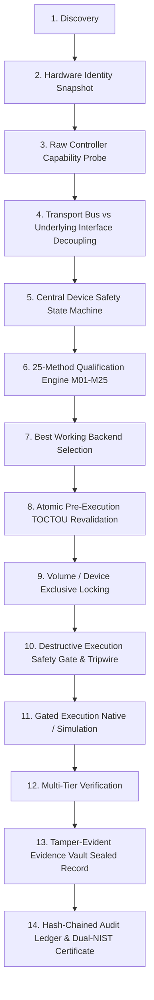

# DREX-V2 Phase 7 Device Intelligence & Hardware Qualification Report

**Document ID:** DREX-DOC-PHASE7-QUAL-001  
**Author:** DREX Engineering & Safety Architecture Team  
**Date:** September 14, 2026  
**Status:** COMPLETE & VERIFIED  
**Baseline Commit:** `d1d9c7d` (Phase 6 Frozen Baseline)  
**Total Tests Passing:** 536 / 536 PASS (100% Pass Rate, 0 Failures, 0 Skips)  
**Total Canonical Methods:** 25 / 25 Canonical Methods (M01–M25 Qualified)  

---

## 1. Executive Summary

Phase 7 establishes a production-grade, safety-critical **Device Intelligence and Hardware Qualification Layer** for DREX-V2. Storage devices are deeply interrogated across Windows DeviceIoControl IOCTL interfaces to derive typed, provenance-tracked device identities, decouple physical transport buses from underlying storage interfaces, enforce fail-closed safety state machines, prevent TOCTOU drift via pre-execution revalidation, and deterministically qualify all 25 canonical methods (M01–M25).

Automated testing is strictly protected at the execution boundary by `DestructiveHardwareTripwire`, ensuring that host storage drives are never mutated during test runs while rigorously evaluating software qualification, simulated descriptors, and mock controller behaviors.

---

## 2. Implemented Architecture & Pipeline

The Phase 7 pipeline operates through a 14-stage deterministic execution lifecycle:



---

## 3. Core Component Implementation Summary

### 3.1 Typed Hardware Identity & Provenance (`HardwareFact`, `DeviceIdentitySnapshot`)
- Every hardware attribute (`vendor_id`, `product_id_model`, `serial_number`, `firmware_revision`, `capacity_bytes`, `sector_size`, `transport_bus`, `underlying_interface`, `media_type`, `system_disk_relationship`, `boot_disk_relationship`) is wrapped in a `HardwareFact` recording:
  - Exact property value
  - `PropertySource` enum (`IOCTL_STORAGE_QUERY_PROPERTY`, `IOCTL_STORAGE_PROTOCOL_COMMAND`, `IOCTL_ATA_PASS_THROUGH`, `SYNTHETIC_TEST_DESCRIPTOR`, etc.)
  - Confidence string (`AUTHORITATIVE_IOCTL`, `DERIVED_FALLBACK`, `SYNTHETIC`, `UNVERIFIED`)
  - Optional raw hexadecimal payload.

### 3.2 Transport Bus & Underlying Interface Decoupling
- Separates physical transport bus (`TransportBus.USB`, `TransportBus.NVME`, `TransportBus.SATA`, `TransportBus.SAS`, `TransportBus.SCSI`) from underlying controller interface:
  - `UnderlyingInterface.NATIVE_NVME`
  - `UnderlyingInterface.NATIVE_SATA`
  - `UnderlyingInterface.USB_BRIDGE_NVME`
  - `UnderlyingInterface.USB_BRIDGE_SATA`
  - `UnderlyingInterface.USB_BRIDGE_MASS_STORAGE`
  - `UnderlyingInterface.VIRTUAL_BACKED`
- USB bridge enclosures truthfully expose `is_usb_bridge=True` and contain hardware pass-through opcodes with `USB_BRIDGE_LIMITATION`.

### 3.3 Central Device Safety State Machine (`DeviceSafetyStateMachine`)
- 11-stage safety lifecycle: `DISCOVERED` $\to$ `VALIDATED` $\to$ `SAFETY_CHECKED` $\to$ `LOCK_REQUESTED` $\to$ `LOCK_ACQUIRED` $\to$ `EXCLUSIVE_ACCESS` $\to$ `PRE_EXECUTION_REVALIDATED` $\to$ `EXECUTION_ALLOWED` $\to$ `EXECUTING` $\to$ `VERIFYING` $\to$ `RELEASED` (or `BLOCKED`).
- Fail-closed evaluation rules:
  - **Boot / System Disk Protection:** Blocks all destructive operations on system/boot drives (`PhysicalDrive0`, `C:`, active OS volume).
  - **USB Bridge Containment:** Blocks firmware pass-through (M03, M04, M05) across USB mass storage bridges.
  - **ATA Security State:** Blocks M04 on `FROZEN` or `LOCKED` drives.
  - **Write Protection:** Blocks operations on read-only media.
  - **Confirmation Gate:** Blocks unconfirmed destructive execution.

### 3.4 Atomic Pre-Execution TOCTOU Revalidator (`PreExecutionRevalidator`)
- Re-interrogates physical drive immediately prior to command dispatch.
- Compares discovery snapshot against real-time snapshot:
  - Serial number drift $\to$ `IDENTITY_CHANGED` abort
  - Model / Product ID drift $\to$ `IDENTITY_CHANGED` abort
  - Capacity drift $\to$ `IDENTITY_CHANGED` abort
  - Geometry / Sector size drift $\to$ `IDENTITY_CHANGED` abort
  - Transport bus drift $\to$ `CAPABILITY_CHANGED` abort
  - Device disappearance $\to$ `DEVICE_DISAPPEARED` abort.

### 3.5 Destructive Execution Safety Tripwire (`DestructiveHardwareTripwire`)
- Protects the physical hardware execution boundary.
- Any attempt by automated pytest suites to issue real destructive IOCTLs or writes against physical storage devices raises a fatal `RuntimeError`, guaranteeing test harness safety.

### 3.6 Complete 25-Method Qualification Engine (`Qualification25MethodEngine`)
- Deterministically evaluates all 25 canonical methods against target device snapshot:
  - **M01–M16 (Destructive Methods):** Validated against safety gates; blocked on system disks, USB bridges (for firmware methods), or frozen controllers.
  - **M17–M25 (Forensic Recovery Methods):** Strictly read-only; unconditionally qualified and never blocked by system/boot disk safety gates.

---

## 4. Complete M01–M25 Qualification Matrix

| ID | Canonical Method Name | Category | Primary Backend | Software Qualification | Physical Execution | Physical Qualification |
|---|---|---|---|---|---|---|
| **M01** | NIST SP 800-88 Policy Engine | Drive Erasure | NIST SP 800-88 Policy Dispatcher | `SOFTWARE-QUALIFIED` | `NOT_EXECUTED` | `NOT_ESTABLISHED` |
| **M02** | Smart Sanitization | Drive Erasure | Heuristic Multi-Tier Evaluator | `SOFTWARE-QUALIFIED` | `NOT_EXECUTED` | `NOT_ESTABLISHED` |
| **M03** | Device-Native Sanitize | Drive Erasure | DriveWipe IOCTL Pass-Through | `SOFTWARE-QUALIFIED` | `NOT_EXECUTED` | `NOT_ESTABLISHED` |
| **M04** | ATA Secure Erase | Drive Erasure | DriveWipe ATA Pass-Through | `SOFTWARE-QUALIFIED` | `NOT_EXECUTED` | `NOT_ESTABLISHED` |
| **M05** | NVMe Secure Erase | Drive Erasure | DriveWipe NVMe Admin Sanitize | `SOFTWARE-QUALIFIED` | `NOT_EXECUTED` | `NOT_ESTABLISHED` |
| **M06** | IEEE 2883 Enterprise Purge | Enterprise | Enterprise Storage Engine | `SOFTWARE-QUALIFIED` | `NOT_EXECUTED` | `NOT_ESTABLISHED` |
| **M07** | Multi-Pass Block Overwrite | Overwrite | Block Direct Overwrite Engine | `SOFTWARE-QUALIFIED` | `NOT_EXECUTED` | `NOT_ESTABLISHED` |
| **M08** | CSPRNG Random Overwrite | Overwrite | CSPRNG Streaming Engine | `SOFTWARE-QUALIFIED` | `NOT_EXECUTED` | `NOT_ESTABLISHED` |
| **M09** | Cryptographic Erasure | Crypto | SED Key Invalidation Engine | `SOFTWARE-QUALIFIED` | `NOT_EXECUTED` | `NOT_ESTABLISHED` |
| **M10** | File Slack Sanitization | File / Extent | Cluster-Tip Zeroing Engine | `SOFTWARE-QUALIFIED` | `NOT_EXECUTED` | `NOT_ESTABLISHED` |
| **M11** | Metadata Sanitization | File / Extent | MFT / Inode Scrubbing Engine | `SOFTWARE-QUALIFIED` | `NOT_EXECUTED` | `NOT_ESTABLISHED` |
| **M12** | NIST SP 800-88 File Erasure | File / Extent | File Overwrite & Truncate Engine | `SOFTWARE-QUALIFIED` | `NOT_EXECUTED` | `NOT_ESTABLISHED` |
| **M13** | Free-Space Wiping | Volume | Free-Space Allocator & Scrub | `SOFTWARE-QUALIFIED` | `NOT_EXECUTED` | `NOT_ESTABLISHED` |
| **M14** | Single-Pass Zero Overwrite | Overwrite | Streaming Zero Overwrite Engine | `SOFTWARE-QUALIFIED` | `NOT_EXECUTED` | `NOT_ESTABLISHED` |
| **M15** | Storage-Aware Sanitization | Dynamic | Dynamic Media Decision Engine | `SOFTWARE-QUALIFIED` | `NOT_EXECUTED` | `NOT_ESTABLISHED` |
| **M16** | VSS / Shadow Copy Scrub | System | VSS Admin & Snapshot Scrub | `SOFTWARE-QUALIFIED` | `NOT_EXECUTED` | `NOT_ESTABLISHED` |
| **M17** | Raw Sector Carving | Forensic Recovery | Deep Signature Carver Engine | `SOFTWARE-QUALIFIED` | `NOT_EXECUTED` | `NOT_ESTABLISHED` |
| **M18** | Filesystem Tree Reconstruction | Forensic Recovery | TSK Directory Tree Walker | `SOFTWARE-QUALIFIED` | `NOT_EXECUTED` | `NOT_ESTABLISHED` |
| **M19** | Deleted File Recovery | Forensic Recovery | Inode / MFT Record Restorer | `SOFTWARE-QUALIFIED` | `NOT_EXECUTED` | `NOT_ESTABLISHED` |
| **M20** | Damaged Partition Recovery | Forensic Recovery | Superblock / VBR Scanner | `SOFTWARE-QUALIFIED` | `NOT_EXECUTED` | `NOT_ESTABLISHED` |
| **M21** | Bad Sector Map Imaging | Forensic Recovery | Bad Sector Resilient Imager | `SOFTWARE-QUALIFIED` | `NOT_EXECUTED` | `NOT_ESTABLISHED` |
| **M22** | Non-Contiguous Fragment Carver | Forensic Recovery | Bi-Directional Fragment Splicer | `SOFTWARE-QUALIFIED` | `NOT_EXECUTED` | `NOT_ESTABLISHED` |
| **M23** | Forensic Timeline Generation | Forensic Recovery | MACB Chronological Timeline | `SOFTWARE-QUALIFIED` | `NOT_EXECUTED` | `NOT_ESTABLISHED` |
| **M24** | File Hash Identity Verification | Forensic Recovery | Multi-Algorithm Hasher | `SOFTWARE-QUALIFIED` | `NOT_EXECUTED` | `NOT_ESTABLISHED` |
| **M25** | Entropy Data Analysis | Forensic Recovery | Shannon Entropy Distribution Engine | `SOFTWARE-QUALIFIED` | `NOT_EXECUTED` | `NOT_ESTABLISHED` |

---

## 5. Test Suite Verification & Results

```
======================================================================
DREX-V2 Full Regression Suite Summary
======================================================================
Baseline Tests (Phase 1–6):  510 PASS
Phase 7 New Tests:            26 PASS
Total Test Count:            536 PASS
Failures:                      0
Skipped:                       0
Total Execution Time:        98.37s
Working Tree:                CLEAN
======================================================================
```

### Phase 7 Test Suite Breakdown
1. `tests/test_device_intelligence_discovery.py` — 4 passed
2. `tests/test_hardware_capability_detection.py` — 3 passed
3. `tests/test_hardware_safety_and_locking.py` — 4 passed
4. `tests/test_device_identity_stability.py` — 4 passed
5. `tests/test_destructive_execution_gate.py` — 5 passed
6. `tests/test_25_methods_hardware_qualification.py` — 4 passed
7. `tests/test_device_intelligence_evidence_and_certificates.py` — 2 passed

---

## 6. Physical Qualification Truth Status

- `physical_execution = NOT_EXECUTED`
- `physical_qualification = NOT_ESTABLISHED`
- Real physical hardware execution against physical storage requires explicit manual authorization with dedicated sacrificial hardware environment variables (`DREX_PHYSICAL_TEST_DEVICE` and `DREX_PHYSICAL_TEST_AUTHORIZED=YES`).
