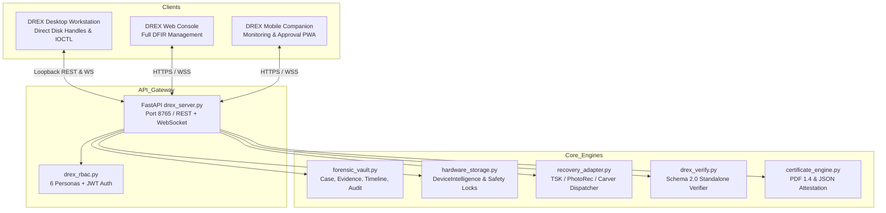

# PHASE 10 MULTI-SURFACE ARCHITECTURE SPECIFICATION

## 1. Executive Overview

**DREX-V2 Phase 10** transforms the unified forensic engine into a production-grade multi-surface ecosystem:
1. **DREX Desktop Workstation**: Privileged Windows workstation operating with direct Win32 disk handles (`\\.\PhysicalDriveX`), IOCTL controller pass-through (NVMe/ATA), and native binary execution (The Sleuth Kit 4.15.0, PhotoRec 7.2).
2. **DREX Web Management Console**: Centralized case, evidence, timeline, audit, verification, and compliance report management application communicating exclusively via authenticated HTTPS/WSS.
3. **DREX Mobile Companion**: Responsive, touch-first companion PWA optimized for glanceable case monitoring, real-time job telemetry, remote authorization/approval of destructive operations, and QR-code certificate verification.

---

## 2. Core Subsystems & Boundaries

---

## 3. Truth-State Governance & Zero Simulation Pretense

- The browser and mobile surfaces **never pretend to have direct physical hardware access**.
- Privileged operations remain strictly inside the DREX Workstation/Server boundary.
- All hardware qualification states reflect real controller capabilities:
  - `PASS — REAL EXECUTION VERIFIED`: Verified on actual storage blocks.
  - `PASS — DECISION ENGINE VERIFIED`: Policy verified against target geometry and interface.
  - `PASS — SYNTHETIC BACKEND VERIFIED`: Pure-Python memory-bounded container executed.
  - `PARTIAL`: Backend binary present, but elevation or device handle limits execution.
  - `UNSUPPORTED`: Controller bus or hardware topology does not support pass-through.
  - `BACKEND UNAVAILABLE`: Required external binary missing on host.

---

## 4. Dynamic Operating System Boot Drive Protection

Dynamic detection replaces hard-coded drive number assumptions:
- Utilizes Win32 `IOCTL_VOLUME_GET_VOLUME_DISK_EXTENTS` via `CreateFileW` with 0 desired access.
- Interrogates `SystemDrive` (e.g. `C:`) and `SystemRoot` (e.g. `C:\Windows`) disk extent records.
- Immediately blocks destructive execution with `422 Unprocessable Content` if a target matches any volume extent backing the active operating system.
