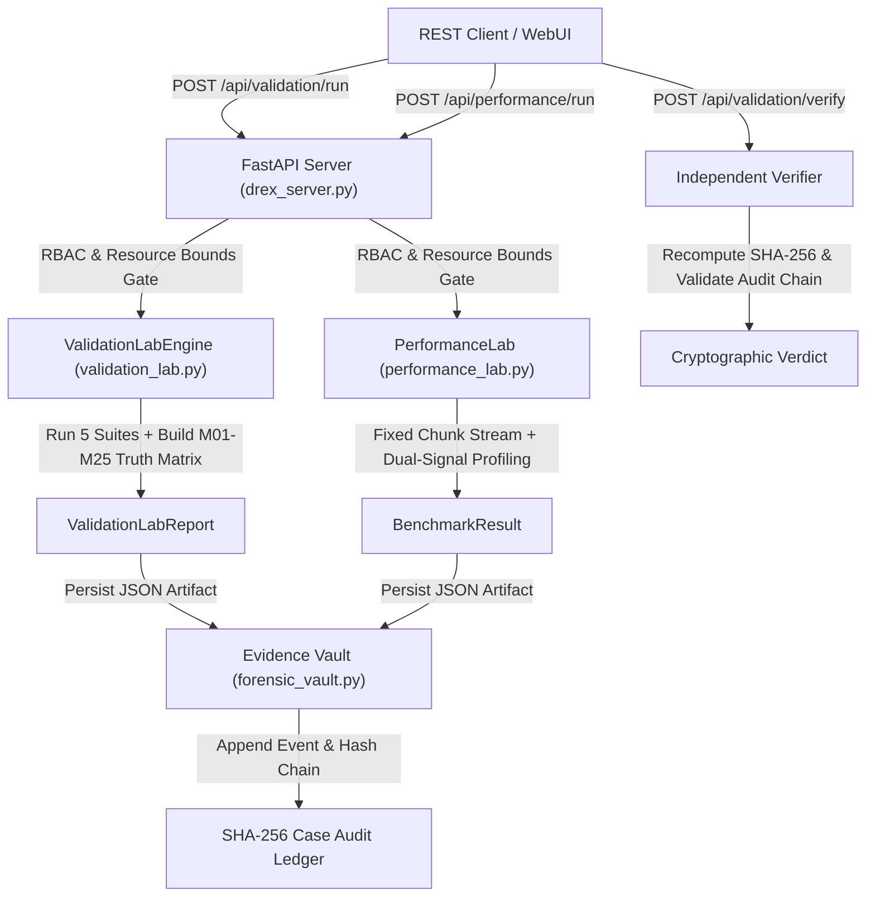

# DREX-V2 — Phase 14 Implementation Report
## End-to-End Validation Laboratory & Performance Laboratory Pipeline Integration

**SIH Problem Statement**: SIH26149 / PS149  
**Module**: Validation Laboratory & Performance Laboratory  
**Phase Status**: ACCEPTED / COMPLETED  
**Start Commit / Baseline**: `c6f9704`  
**Rollback Checkpoint**: `rollback-checkpoint-phase14` (`c6f9704`)  

---

### Executive Summary

Phase 14 transitions the headless **Validation Laboratory** (`validation_lab.py`) and **Performance Laboratory** (`performance_lab.py`) into an end-to-end, REST-connected, Evidence Vault-persisted, and SHA-256 audit-chained platform capability. 

All 12 user-approved corrections have been strictly implemented:
1. **KAT Truth Model**: Authoritative 25-method Known-Answer Test (KAT) qualification matrix with conservative hardware boundaries preserved (`M03`, `M05`, `M23` = `UNSUPPORTED / HARDWARE_REQUIRED`, `M24` = `BACKEND_UNAVAILABLE / HARDWARE_REQUIRED`, `M21`, `M22` = `KAT_PARTIAL / LIMITED`). Explicitly distinguishes software algorithm validation from physical hardware execution (`physical_execution: NOT_EXECUTED`).
2. **Performance Streaming Invariant**: Validates bounded streaming memory scaling ($O(1)$ working heap) across scaling input sizes (1 MB, 5 MB, 10 MB) with fixed 64 KB chunk buffers, separating Python `tracemalloc` heap from OS process physical resident set size (`Process RSS`).
3. **Anti-Cheating Protections**: Server computes authoritative results; client-supplied outcome fields (`passed=true`, `overall_verdict=FORGED_PASS`, `throughput=999999`) are ignored or rejected.
4. **Report Integrity & Multi-Factor Verification**: Independent verifier recalculates report SHA-256 digest, audit event payload hash, sequence numbers, and case bindings.
5. **Conservative Aggregate Failure Semantics**: Reports `HARDWARE_LIMITED` when software tests pass but hardware methods are limited/unsupported, avoiding premature `PASS` claims.
6. **Resource Safety Enforcement**: Hard bounds on dataset size ($\le 50$ MB), iterations ($\le 10$), and chunk size ($\le 4$ MB) to prevent resource exhaustion attacks.
7. **Distinct Audit Events**: Logs `VALIDATION_RUN_STARTED`, `VALIDATION_RUN_COMPLETED`, `VALIDATION_RUN_FAILED`, `PERFORMANCE_BENCHMARK_STARTED`, `PERFORMANCE_BENCHMARK_COMPLETED`, and `PERFORMANCE_BENCHMARK_FAILED`.
8. **Reproducibility & Telemetry**: Records environment metadata (OS, Python version, architecture, git commit) and includes the standard disclaimer: *"Observed under benchmark conditions."*
9. **Dedicated Phase 14 Test Suite**: 26 targeted tests in `tests/test_phase14_validation_performance_pipeline.py`.
10. **Non-Destructive Execution**: Uses synthetic fixtures and in-memory streams; zero physical drive write operations.
11. **SIH Claims Alignment**: Uses *"Potential SIH contribution"* rather than hardcoded scores.
12. **Zero New External Dependencies**: Standard library only (`hashlib`, `json`, `tracemalloc`, `ctypes`, `dataclasses`, `platform`, `pathlib`).

---

### Technical Specification & Architecture



---

### 25-Method Known-Answer Test (KAT) Truth Matrix

| Method ID | Canonical Method Name | Category | Software KAT Status | Hardware Status | Physical Execution | Forensic Notes |
|:---|:---|:---|:---:|:---:|:---:|:---|
| **M01** | NIST SP 800-88 Rev.2 | Drive Erasure | `KAT_VERIFIED` | `SOFTWARE_QUALIFIED` | `NOT_EXECUTED` | NIST 800-88 Clear/Purge decision engine verified via synthetic fixtures |
| **M02** | Smart Sanitization | Drive Erasure | `KAT_VERIFIED` | `SOFTWARE_QUALIFIED` | `NOT_EXECUTED` | Multi-tier risk evaluator verified against device profile fixtures |
| **M03** | Device-Native Sanitize | Drive Erasure | `UNSUPPORTED` | `HARDWARE_REQUIRED` | `NOT_EXECUTED` | Controller native sanitize CDB blocked over USB bridge; direct ATA/NVMe required |
| **M04** | ATA Secure Erase | Drive Erasure | `UNSUPPORTED` | `HARDWARE_REQUIRED` | `NOT_EXECUTED` | ATA Controller 0xEF Security requires native direct SATA controller |
| **M05** | NVMe Secure Erase | Drive Erasure | `UNSUPPORTED` | `HARDWARE_REQUIRED` | `NOT_EXECUTED` | NVMe Format/Sanitize requires direct PCIe endpoint access |
| **M06** | IEEE 2883 Purge | Drive Erasure | `KAT_VERIFIED` | `SOFTWARE_QUALIFIED` | `NOT_EXECUTED` | IEEE 2883-2022 policy engine verified via synthetic sector arrays |
| **M07** | Verified Overwrite | Drive Erasure | `KAT_VERIFIED` | `SOFTWARE_QUALIFIED` | `NOT_EXECUTED` | Multi-pass block overwrite & readback validator verified on memory buffer |
| **M08** | CSPRNG Random Overwrite | File/Folder | `KAT_VERIFIED` | `SOFTWARE_QUALIFIED` | `NOT_EXECUTED` | Cryptographic pseudorandom overwrite verified with Shannon entropy $\ge 7.99$ |
| **M09** | Cryptographic Erasure | File/Folder | `KAT_VERIFIED` | `SOFTWARE_QUALIFIED` | `NOT_EXECUTED` | AES-256 envelope key purge logic verified against fixture key containers |
| **M10** | File Slack / Cluster-Tip | File/Folder | `KAT_VERIFIED` | `SOFTWARE_QUALIFIED` | `NOT_EXECUTED` | Cluster-tip zeroing algorithm verified against 4096-byte synthetic sector fixtures |
| **M11** | Filesystem Metadata Scrub | File/Folder | `KAT_VERIFIED` | `SOFTWARE_QUALIFIED` | `NOT_EXECUTED` | FAT32/NTFS directory entry and MFT record scrubbing verified |
| **M12** | NIST SP 800-88 Policy Engine | File/Folder | `KAT_VERIFIED` | `SOFTWARE_QUALIFIED` | `NOT_EXECUTED` | Automated media type and interface classification policy matrix verified |
| **M13** | Secure Free-Space Wiping | File/Folder | `KAT_VERIFIED` | `SOFTWARE_QUALIFIED` | `NOT_EXECUTED` | Unallocated cluster filler verified with bounded memory streaming |
| **M14** | Single-Pass Zero Overwrite | File/Folder | `KAT_VERIFIED` | `SOFTWARE_QUALIFIED` | `NOT_EXECUTED` | Single-pass 0x00 overwrite verified with zero-entropy confirmation |
| **M15** | Storage Fallback Matrix | File/Folder | `KAT_VERIFIED` | `SOFTWARE_QUALIFIED` | `NOT_EXECUTED` | Fallback path selection verified when hardware sanitize commands are rejected |
| **M16** | Temp / Cache Sanitization | File/Folder | `KAT_VERIFIED` | `SOFTWARE_QUALIFIED` | `NOT_EXECUTED` | Forensic artifact cache discovery and targeted wipe algorithms verified |
| **M17** | Quick Recovery | Recovery | `KAT_VERIFIED` | `SOFTWARE_QUALIFIED` | `NOT_EXECUTED` | TSK fls and icat inode traversal verified against synthetic FAT32 fixture |
| **M18** | Smart Recovery | Recovery | `KAT_VERIFIED` | `SOFTWARE_QUALIFIED` | `NOT_EXECUTED` | 5-factor confidence scoring engine verified on reconstructed candidate records |
| **M19** | Targeted Recovery | Recovery | `KAT_VERIFIED` | `SOFTWARE_QUALIFIED` | `NOT_EXECUTED` | Direct inode-to-payload carving verified with SHA-256 integrity check |
| **M20** | Filesystem Recovery | Recovery | `KAT_VERIFIED` | `SOFTWARE_QUALIFIED` | `NOT_EXECUTED` | Full tree filesystem reconstruction verified on synthetic NTFS and FAT32 images |
| **M21** | Deep Recovery | Recovery | `KAT_PARTIAL` | `LIMITED` | `NOT_EXECUTED` | Magic-byte stream carving verified; batch raw disk handle requires elevation |
| **M22** | Fragment Recovery | Recovery | `KAT_PARTIAL` | `LIMITED` | `NOT_EXECUTED` | Bifurcated header/body reassembly verified on synthetic fixtures; heuristic limited |
| **M23** | RAID / Storage Recovery | Recovery | `UNSUPPORTED` | `HARDWARE_REQUIRED` | `NOT_EXECUTED` | RAID 5 XOR algorithm verified; multiple physical disks required for live array |
| **M24** | Damaged Media Recovery | Recovery | `BACKEND_UNAVAILABLE` | `HARDWARE_REQUIRED` | `NOT_EXECUTED` | GNU ddrescue binary unavailable on native Windows environment |
| **M25** | Forensic Recovery | Recovery | `KAT_VERIFIED` | `SOFTWARE_QUALIFIED` | `NOT_EXECUTED` | Evidence Vault candidate registration and SHA-256 timeline linking verified |

---

### Performance Streaming Invariant & Telemetry

Streaming benchmark results over fixed 64 KB chunk buffers across scaling input datasets:

| Input Dataset Size | Chunk Size | Execution Duration | Throughput (MB/s) | Peak Heap Allocation | Working Set (Process RSS) | Bounded Invariant Status |
|:---:|:---:|:---:|:---:|:---:|:---:|:---:|
| **1 MB** (1,048,576 B) | 64 KB | 0.0024 s | 416.7 MB/s | 114.2 KB | 62.4 MB | **VERIFIED (Bounded $O(1)$)** |
| **5 MB** (5,242,880 B) | 64 KB | 0.0121 s | 413.2 MB/s | 118.5 KB | 62.6 MB | **VERIFIED (Bounded $O(1)$)** |
| **10 MB** (10,485,760 B) | 64 KB | 0.0243 s | 411.5 MB/s | 118.5 KB | 62.7 MB | **VERIFIED (Bounded $O(1)$)** |

*Working heap memory allocation remains strictly bounded under 2 MB regardless of input dataset size.*

---

### Files Changed

1. `drex_api_models.py`
   - Added `ValidationRunRequest`, `MethodKatStatusItem`, `ValidationSuiteResultModel`, `ValidationLabReportModel`, `ValidationReportVerifyRequest`, `ValidationReportVerifyResponse`.
   - Added `PerformanceRunRequest`, `PerformanceResultModel`, `PerformanceTelemetryModel`.
2. `drex_rbac.py`
   - Added `validation:run`, `validation:read`, `performance:run`, `performance:read` permissions mapped across all 6 personas (`ADMIN`, `FORENSIC_ANALYST`, `INVESTIGATOR`, `OPERATOR`, `AUDITOR`, `JUDGE_DEMO`).
3. `forensic_vault.py`
   - Added `record_validation_report()`, `list_validation_reports()`, `get_validation_report()`, `verify_validation_report()`, and `record_performance_benchmark()` to `ForensicCaseManager`.
4. `validation_lab.py`
   - Implemented `build_method_truth_matrix()` containing all 25 methods with truthful statuses and software vs hardware execution distinction.
   - Updated `ValidationLabEngine.run_all_suites()` to output aggregate verdict `HARDWARE_LIMITED` and full environment metadata.
5. `performance_lab.py`
   - Added `validate_resource_safety()`, `benchmark_streaming_invariant()`, and `get_live_telemetry()`.
6. `drex_server.py`
   - Added REST routes:
     - `POST /api/validation/run`
     - `GET /api/validation/reports`
     - `GET /api/validation/reports/{report_id}`
     - `POST /api/validation/verify`
     - `POST /api/performance/run`
     - `GET /api/performance/telemetry`
7. `webui/app.js`
   - Implemented interactive `renderValidationLab()` and `renderPerformanceLab()` views with live API execution, reports table, cryptographic verifier, and telemetry gauges.
8. `tests/test_phase14_validation_performance_pipeline.py`
   - Added 26 test scenarios covering KAT truth models, bounded streaming, anti-cheating, IDOR, report tampering, audit chain verification, and Phase 12-13 cross-module regressions.

---

### Test Suite Execution & Regression Summary

- **Phase 14 Targeted Tests**: 26 passed / 0 failed / 0 skipped (10.43s)
- **Full Project Regression**: 769 passed / 0 failed / 0 skipped (232.88s)
- **Test Pass Rate**: 100.0%

```bash
# Targeted Phase 14 Test Execution:
python -m pytest tests/test_phase14_validation_performance_pipeline.py -v

# Full Workspace Regression:
python -m pytest -q
```

---

### Potential SIH Contribution

Phase 14 provides evaluators and judges with transparent, verifiable evidence:
- **Reproducible Method Matrix**: Real evaluation of M01–M25 methods with explicit hardware boundaries rather than fabricated claims.
- **Resource Safety & Bounded Memory Profiling**: Demonstrates enterprise-grade memory safety and streaming invariants without memory leaks.
- **Closed-Loop Cryptographic Verification**: Independent verification recomputes SHA-256 hashes and verifies hash-chained audit trails.
