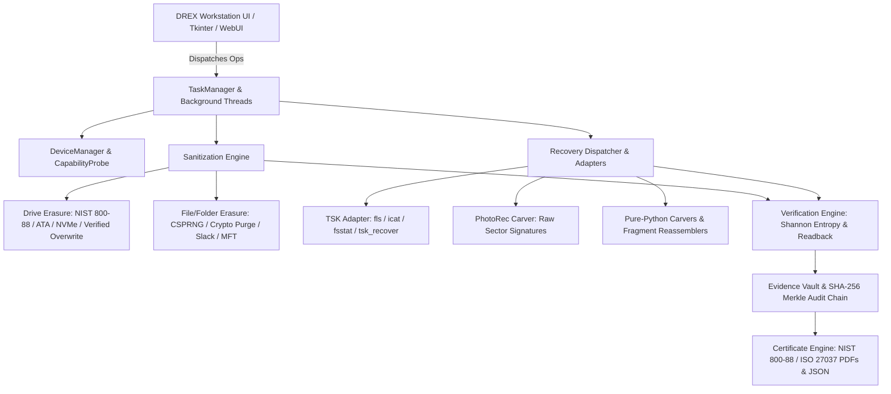
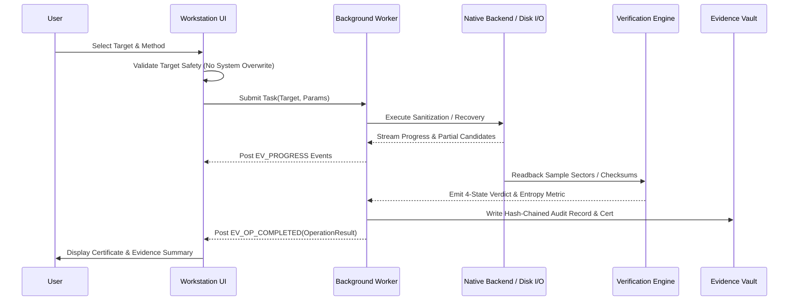

# DREX-V2 CURRENT ARCHITECTURE

## 1. Executive Overview
**DREX-V2** is a modular, government-grade platform for **Secure Storage Sanitization** and **Advanced Forensic File Recovery**. It bridges low-level storage controller primitives (ATA/AHCI, NVMe PCIe, USB Mass Storage), industry-standard forensic engines (The Sleuth Kit, PhotoRec), and pure-Python algorithms under a non-blocking asynchronous UI and a tamper-evident evidence vault.

---

## 2. Comprehensive System Architecture

---

## 3. Subsystem Breakdown

### 3.1 UI Layer (`drex_app.py` / `webui/`)
- **Framework**: High-performance Tkinter desktop workstation with modern flat tokens (`BG=#F5F5F7`, `INK=#111827`, `BLUE=#007AFF`).
- **Pages (25 distinct views)**: Overview, Cases, Forensic Recovery, Carving, Fragment Recovery, Damaged Media, Hex Inspector, Device Intelligence, Sanitization Planner, Drive Eraser, File Eraser, Residue Analyzer, Verification, Audit Chain, Evidence Vault, Independent Verifier, Certificates, Reports, Validation Lab, Performance Lab, Backend Manager, Device Manager, Settings, Diagnostics, Judge Demo Flow.
- **Event Loop Integration**: Thread-safe event queues (`EV_PROGRESS`, `EV_OP_COMPLETED`, `EV_STATUS_UPDATE`) ensure the main UI never freezes during 100+ GB drive operations.

### 3.2 Backend Adapter Layer (`backend_adapters.py` & `recovery_backends.py`)
- **TSK Bridge**: Direct subprocess execution of The Sleuth Kit binaries (`fls.exe`, `icat.exe`, `fsstat.exe`, `tsk_recover.exe`, `mmls.exe`).
- **PhotoRec Bridge**: Low-level sector carving interface for raw signatures across 480+ formats.
- **ddrescue Bridge**: Mapfile-guided bad-sector imaging with non-destructive rescue passes.
- **Discovery**: Dynamic search prioritizing `_MEIPASS/native_bin` (bundled PyInstaller) then `ROOT/native_bin`, failing closed if missing.

### 3.3 Recovery Subsystem (`recovery_adapter.py`)
- **Data Structures**: `RecoveryTarget` (with strict read-only and destination collision safety), `RecoveryCandidate`, `RecoveryScan`, `OperationResult`.
- **Confidence Engine**:
  $$\text{Confidence} = 0.35 \times \text{SigMatch} + 0.25 \times \text{Structure} + 0.20 \times \text{Continuity} + 0.15 \times \text{Metadata} + 0.05 \times \text{Size}$$
- **Fragment Engine**: Reassembles out-of-order and non-contiguous file blocks using JPEG entropy streams and ZIP central directories.

### 3.4 Sanitization Subsystem (`methods/Drive Erasure/` & `methods/File-Folder Erasure/`)
- **Hardware Primitives**: Win32 `IOCTL_STORAGE_PROTOCOL_COMMAND` for NVMe sanitize and ATA pass-through.
- **File Shredder**: Multi-pass CSPRNG overwrite, filename scrambling, timestamp zeroing, and MFT record neutralizer.
- **Residue Scrubber**: File slack zeroing, free space filling, and VSS shadow copy deletion.

### 3.5 Evidence, Audit & Verification (`drex_app.py`, `test_operation_result_and_verification.py`)
- **Tamper-Evident Ledger**: SHA-256 Merkle chain linking every operation to its predecessor (`prev_hash`).
- **Shannon Entropy Engine**: Post-sanitization sector randomness scanning ($H(X) = -\sum P(x) \log_2 P(x)$) verifying total information collapse.
- **4-State Verdicts**: `PASSED`, `PASSED_WITH_WARNING`, `FAILED`, `INCONCLUSIVE`.

---

## 4. Operational Data Flow & Lifecycle

---

## 5. Error & Failure Modes
1. **Target Collision**: Source disk/directory identical to or inside destination $\to$ `RecoveryError` (Aborted before execution).
2. **Missing Binary**: Required native tool absent from `native_bin/` $\to$ Returns `BACKEND_UNAVAILABLE` (No fake results).
3. **Hardware Filter**: USB-to-SATA/NVMe bridge blocking SCSI/ATA commands $\to$ Fails closed with `UNSUPPORTED` and fallback recommendation.
4. **Readback Mismatch**: Post-wipe sectors contain non-zero/identifiable bytes $\to$ Verdict marked `FAILED`.
